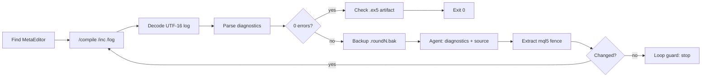

# MQL Companion

This tutorial walks through `examples/mql_companion/` — a workflow for writing MetaTrader Expert Advisors where the compiler, not the model, decides when the code is done. It pairs a MetaEditor command-line driver with a `native_react` agent, an installable `mql5-expert` skill, a preset config, and a benchmark (`mql-bench`) for choosing a model that writes MQL5 instead of MQL4.

!!! tip "Prerequisites"
    - Python 3.10 or later
    - OpenJarvis installed: `uv sync --extra dev` from the repository root
    - An inference engine running — Ollama locally or a cloud API key in `.env`
    - MetaEditor 5 for anything that compiles: a MetaTrader 5 install on Windows, or MetaTrader under Wine on Linux/macOS
    - A **demo** account for anything you eventually run. Every EA this workflow produces must be validated in the Strategy Tester before it touches real money.

## Why the Compiler Has to Be in the Loop

MQL5 is a low-resource language for LLMs: little of it is on the open web, its API changed shape between MQL4 and MQL5, and it looks enough like C that a model will happily invent plausible signatures. The characteristic failure is not a syntax slip — it is confidently emitting MQL4:

| MQL4 idiom | What happens in MQL5 |
|---|---|
| `Ask`, `Bid`, `Point`, `Digits`, `Bars` | Undeclared identifier — use `SymbolInfoDouble`, `_Point`, `_Digits`, `Bars()` |
| `OrderSend(symbol, cmd, volume, price, ...)` | Wrong arity — MQL5 takes a `MqlTradeRequest` and a result struct, usually via `CTrade` |
| `OrderClose`, `OrderModify`, `OrderSelect` | Gone — positions are closed by an opposite deal and selected with `PositionSelect` / `PositionGetTicket` |
| `AccountBalance()`, `MarketInfo()` | Gone — `AccountInfoDouble(ACCOUNT_BALANCE)`, `SymbolInfoDouble` |
| `Close[1]`, `Time[0]` series arrays | Gone — `iClose(symbol, period, shift)` or `CopyClose` into a buffer |
| `iMA(...)` returning a value | Returns a *handle*; values come from `CopyBuffer` |

Some of these fail to compile. The dangerous ones compile and trade wrongly. So the loop is: compile with MetaEditor, feed the exact diagnostics back to the agent, let it fix the source, recompile — until the build is clean or the round budget runs out.

## What's in the Example

| File | Purpose |
|---|---|
| `metaeditor.py` | MetaEditor CLI driver — discovery, UTF-16 log decode, diagnostic parsing, artifact detection |
| `compile_loop.py` | The compile → fix → recompile loop over the OpenJarvis SDK |
| `mt5_mcp_server.py` | MCP bridge to a running terminal — live quotes, contract specs, margin maths, tester reports, gated demo orders |
| `tester_report.py` | Strategy Tester report reader — metrics, CI thresholds, run comparison, headless backtests |
| `install_skill.py` | Validate and install the `mql5-expert` skill |
| `skills/mql5-expert/` | Instructions, a 2-step pipeline, three reference docs, an EA template |
| `configs/openjarvis/examples/mql-assistant.toml` | Preset config (`jarvis init --preset mql-assistant`) |
| `src/openjarvis/evals/{datasets,scorers}/mql_bench.py` | The `mql-bench` benchmark |

## The MetaEditor Command Line

MetaQuotes removed the standalone `mql.exe` compiler, so MetaEditor is the only way to build. Four facts shape `metaeditor.py`:

```bash
metaeditor64.exe /compile:"C:\...\MQL5\Experts\MyEA.mq5" /inc:"C:\...\MQL5" /log:"C:\...\MyEA.mq5.log"
```

1. **`/log` writes UTF-16LE.** Reading it as UTF-8 mostly *works* — which is the trap: ASCII in UTF-16LE decodes as valid UTF-8 with interleaved NUL bytes, so every line comes back corrupted rather than raising. `decode_compile_log()` sniffs the BOM, then NUL *parity* when there is none (LE puts NULs on odd offsets, BE on even ones, and guessing wrong yields plausible CJK glyphs rather than an error), then falls back through UTF-8 → cp1251 → latin-1, and strips a leading BOM so it cannot be glued to the first diagnostic's file name.
2. **The exit code is advisory.** Community scripts report it inverted (0 = failed, 1 = success) across builds, so `compile_source()` trusts the parsed summary line — `0 errors, 0 warnings` — and treats the process exit code as a hint.
3. **Diagnostics come in two shapes.** The positional `path(line,col) : error C2065: message` form and a tabular form; `parse_compile_log()` handles both plus the summary variants.
4. **A clean log is not proof of a build.** MetaEditor can report zero errors and write no `.ex5`. When the log is clean but the artifact is missing, the result carries a `note` ("silent CLI failure or stale artifact") instead of a false success. The artifact must also post-date *this run*, not merely the source, so a previous build's `.ex5` is never credited to a rebuild that wrote nothing.
5. **The summary cannot clear the diagnostics.** `N errors, M warnings` may raise the error count — an included file's diagnostics are counted without always being listed — but never lower it below what the parser found. And a log holding neither a summary nor one parseable diagnostic is reported as a toolchain failure (exit code 2), not as a silent success.

## Step 1: Compile and Report Only

The deterministic half of the loop needs no model at all — handy in CI, or to check a file before you ask an agent to touch it:

```bash title="Terminal"
python examples/mql_companion/compile_loop.py --source MyEA.mq5 --compile-only
```

```text
source:     MyEA.mq5
metaeditor: C:\Program Files\MetaTrader 5\metaeditor64.exe
mode:       compile-only
--------------------------------------------------------------------
round 0 (compile only)
    cmd: metaeditor64.exe /compile:MyEA.mq5 /inc:C:\...\MQL5 /log:MyEA.mq5.log
    error   MyEA.mq5(24,17) : error C2065: 'Ask' - undeclared identifier
    error   MyEA.mq5(31,5)  : error C2664: 'OrderSend' - wrong parameters count
    summary: 2 errors, 0 warnings
FAILED — 2 error(s).
```

Exit codes: **0** clean compile, **1** still failing, **2** toolchain problem (MetaEditor not found, unreadable source, no readable compile log). Add `--json-out report.json` for a machine-readable round-by-round report, and `--syntax-only` to pass `/s` (parse check, no artifact).

## Step 2: The Fix Loop



Drop `--compile-only` and the loop calls the model:

```bash title="Terminal"
python examples/mql_companion/compile_loop.py \
    --source "<MT5 data folder>/MQL5/Experts/MyEA.mq5" \
    --max-rounds 5
```

Each round snapshots the file as `MyEA.mq5.round1.bak` before rewriting it (`--no-backup` disables this), so a bad fix is always recoverable. The loop stops early if the model returns an unchanged file — that is a loop guard, not a failure to notice: burning the remaining rounds on the same answer would just burn tokens.

Two modes control who writes the file:

| Mode | Behaviour |
|---|---|
| `--mode rewrite` (default) | The model returns the whole file; the script extracts the ```mql5 fence and writes it |
| `--mode agent-tools` | The agent gets `file_read`, `apply_patch`, `shell_exec`, `think` and patches the file itself |

`rewrite` is more predictable with small local models; `agent-tools` suits a strong model that should make a surgical change to a large EA. Use `--context MyLib.mqh` (repeatable) to show the model included headers it cannot see from the source file alone.

## Step 3: Linux and macOS Through Wine

MetaEditor is a Windows binary, but it runs fine under Wine — which is how you get this loop on a Linux VPS next to a headless MT5 terminal:

```bash title="Terminal"
python examples/mql_companion/compile_loop.py --source MyEA.mq5 \
    --metaeditor ~/.wine/drive_c/MT5/metaeditor64.exe \
    --inc ~/.wine/drive_c/MT5/MQL5
```

`find_metaeditor()` searches `METAEDITOR_PATH` / `METAEDITOR` / `MQL_EDITOR`, `Program Files`, broker-specific install globs, `APPDATA/MetaQuotes`, `~/.wine*`, and `PATH`; `needs_wine()` adds the `wine` prefix automatically on non-Windows hosts. `--wine` / `--no-wine` override the detection.

## Step 4: Install the Skill

The skill carries the domain knowledge — the checklist, the error-code table, the porting map — so an agent invocation starts from it instead of from nothing:

```bash title="Terminal"
python examples/mql_companion/install_skill.py --dry-run     # validate, write nothing
python examples/mql_companion/install_skill.py               # install
jarvis skill list                                            # -> mql5-expert
jarvis skill run mql5-expert -a file_path=MyEA.mq5
jarvis ask "Use the mql5-expert skill to review MyEA.mq5 for MQL4-isms"
```

`install_skill.py` validates with `load_skill_directory()` before touching your config directory, installs through `SkillImporter`, and copies `skill.toml` separately (the importer does not carry pipeline manifests).

!!! warning "Use forward slashes in `-a file_path=...`"
    `skill.toml` interpolates arguments into a JSON template with raw `{key}` substitution, so a Windows path with backslashes (`C:\Users\me\MyEA.mq5`) yields invalid JSON (`\U` is not a valid escape) and the run fails before it starts. Pass `C:/Users/me/MyEA.mq5`. MetaEditor accepts either separator — only this argument is picky.

Inside the skill:

- **`SKILL.md`** declares `allowed-tools: file_read, file_write, apply_patch, shell_exec, knowledge_search, think` and holds the review checklist, the porting rules, and the output format (findings grouped Blocker / Bug / Risk / Style with `file(line,col)`).
- **`skill.toml`** runs two deterministic steps — `file_read` → `source_code`, then `think` → `review`. Only JSON-safe scalars are interpolated; the deep work happens on the instruction path, where the agent composes its own tool calls.
- **`references/`** holds `compile-errors.md` (MetaEditor codes → fix), `mql4-to-mql5.md` (porting table), and `mql5-api-cheatsheet.md` (signatures).
- **`templates/ea-template.mq5`** is a starting EA that already handles indicator handle lifecycle, a new-bar guard, a spread filter, magic-number filtering, fixed-fractional lot sizing normalized to `SYMBOL_VOLUME_STEP`, and `CTrade` order flow.

## Step 5: Use the Preset Config

```bash title="Terminal"
jarvis init --preset mql-assistant --force
```

The preset picks settings that matter for this workload: the largest local code model for `-m code`, `temperature = 0.2` (signatures must be reproduced exactly, not invented), `max_tokens = 4096` (whole EA files, not snippets), `orchestrator` with 14 turns (loops need room), `shell_exec` enabled so the agent can drive the compiler, `knowledge_search` for verifying signatures, and tight memory chunking (512/96) tuned for API docs rather than prose.

Index the MQL5 reference once and the agent stops guessing signatures:

```bash title="Terminal"
jarvis memory index ./mql5-reference/
jarvis ask --agent native_react "Add an ATR-based trailing stop to MyEA.mq5"
```

> **`memory index` needs the native memory backend.** Indexing writes through
> `openjarvis_rust`, so a checkout that never built the extension stops with
> `MemoryBackendUnavailable` and a traceback that tells you how to build it
> (`uv run maturin develop -m rust/crates/openjarvis-python/Cargo.toml`, rustc
> >= 1.88). It is the only command on this page with that requirement: the
> skill, `tester_report.py`, and the MCP bridge all run on a plain Python
> install.

Or point the loop at the preset without replacing your global config:

```bash title="Terminal"
python examples/mql_companion/compile_loop.py --source MyEA.mq5 \
    --config configs/openjarvis/examples/mql-assistant.toml
```

`--model` and `--engine` override the preset; omit them and the preset decides.

!!! warning "This preset enables `shell_exec`"
    It runs as your user with no allowlist. Keep it on a machine or VPS that holds no live trading credentials. There is no `allowed_dirs` config key for the file tools either — if you want a filesystem jail, run the agent in the container sandbox instead.

## Step 6: Choose a Model with `mql-bench`

Before you spend rounds fixing a model's output, measure which model produces less to fix. `mql-bench` is 12 MQL5 tasks — indicator handles, `CTrade` order flow, fixed-fractional lot sizing, trailing stops, and MQL4→MQL5 ports — scored deterministically and structurally, so it needs no compiler and runs in CI:

```bash title="Terminal"
jarvis eval run -b mql-bench -m qwen3.5:35b --backend jarvis-direct
jarvis eval run -b mql-bench -m qwen3.5:9b -o results/mql_9b.jsonl
jarvis eval compare results/mql_35b.jsonl results/mql_9b.jsonl
```

| Component | Weight | What it checks |
|---|---|---|
| `required` | 0.70 | The API surface a correct answer cannot avoid |
| `forbid_mql4` | 0.20 | MQL4-only idioms that must not appear (⅓ of the weight per hit, floored at 0) |
| `optional` | 0.10 | Best practices that separate a good answer from a working one |

A task counts as correct only when every `required` check passes **and** zero MQL4-isms are found **and** the answer is non-empty. Checks are plain substrings, or regexes with a `re:` prefix; `OrderSend` arity is detected by counting top-level commas inside balanced parentheses, so a model cannot dodge it by renaming variables. When a task declares no `optional` checks, the weights renormalize to 0.78 / 0.22.

The scorer extracts the answer by preferring a ```mql5 fence, then a ```mql4 fence (for porting tasks), then the last MQL-shaped generic fence, then the first fence, then the whole reply — and it strips comments and string literals with offsets preserved before scanning, so a doc comment mentioning `OrderSend` does not register as an MQL4-ism.

Add your own tasks by appending to `_TASKS` in `src/openjarvis/evals/datasets/mql_bench.py`.

## Running It on a Schedule

The compile-only path is deterministic, so it drops straight into CI or cron:

```bash title="Terminal"
python examples/mql_companion/compile_loop.py --source MyEA.mq5 \
    --compile-only --json-out results/compile.json
```

For an agent-driven nightly check, register a scheduler task that runs it and reports (the agent needs `shell_exec`):

```bash title="Terminal"
jarvis scheduler create "Run python examples/mql_companion/compile_loop.py --source MyEA.mq5 --compile-only and report any errors with line numbers" \
    --type cron --value "0 6 * * *"
jarvis scheduler start
```

## Going Further: Live Market Data

Compiling is half the job. The other half is that an EA has to be *right about
its broker*: digits, point, stops level, contract size, tick value, filling
modes and volume limits all differ per symbol and per account, and a model can
only guess them. `examples/mql_companion/mt5_mcp_server.py` removes the
guessing — it exposes a running MetaTrader 5 terminal as MCP tools that
OpenJarvis discovers and wraps like any other tool.

```bash title="Terminal"
# what does it expose? (no terminal needed)
python examples/mql_companion/mt5_mcp_server.py --stub --list-tools

# one-shot call, pretty-printed
python examples/mql_companion/mt5_mcp_server.py --stub \
    --call mt5_calc --args '{"symbol":"EURUSD","side":"buy","volume":0.5,"price_close":1.09}'
```

```json
{
  "symbol": "EURUSD", "side": "buy", "volume": 0.5,
  "price_open": 1.08512, "price_close": 1.09,
  "margin_required": 542.56, "margin_per_lot": 1085.12,
  "profit_at_close": 244.0,
  "tick_size": 1e-05, "tick_value": 10.0, "contract_size": 100000.0,
  "digits": 5, "stops_level_points": 10, "volume_step": 0.01
}
```

That single call is what a `CalcLotByRisk()` function needs to be checked
against: margin per lot, tick value, contract size and the minimum stop
distance. Instead of the agent asserting that 0.1 lots of EURUSD risks "about
$1 per point", it can compute it.

| Tool | Purpose |
|---|---|
| `mt5_status`, `mt5_account` | Is the bridge attached, and is this a demo account? Balance, equity, margin |
| `mt5_symbols`, `mt5_symbol_info` | Contract specification: digits, point, spread, volume limits, stops level, tick size/value, filling and expiration modes, swap |
| `mt5_tick`, `mt5_rates` | Latest quote and OHLC history across all 21 MT5 periods |
| `mt5_positions`, `mt5_orders` | What is open, filterable by magic number |
| `mt5_calc` | Margin required (also per lot) and profit at a close price |
| `mt5_order_send` | A market order — **only registered with `--allow-trading`, and demo accounts only** |

### Wiring it into the config

Uncomment the `[tools.mcp]` block in the preset, or add it to your own config:

```toml
[tools.mcp]
enabled = true
servers = '[{"name": "mt5", "command": "python", "args": ["examples/mql_companion/mt5_mcp_server.py"]}]'
```

OpenJarvis spawns the bridge as a subprocess, performs the MCP handshake,
discovers the tools with `tools/list`, and wraps each one as a `BaseTool` — so
`mt5_symbol_info` becomes an ordinary tool an agent can call. Use
`include_tools` / `exclude_tools` in the server object to narrow the surface.

!!! warning "A non-empty `[tools] enabled` list filters MCP tools too"
    `jarvis ask` resolves its tool set from `[tools] enabled` and then keeps
    only the MCP tools whose names appear in that list. Configure the bridge
    correctly, leave `mt5_*` out of `enabled`, and the agent still cannot see
    a single terminal tool. The `mql-assistant` preset lists them for you;
    unregistered names are skipped silently, so leaving them there while the
    bridge is off costs nothing.

When the terminal runs on a Windows box and OpenJarvis runs on a Linux VPS,
serve it over HTTP instead:

```bash title="Terminal (Windows)"
python mt5_mcp_server.py --http --host 0.0.0.0 --port 8765 --token SECRET
```

```toml
[tools.mcp]
enabled = true
servers = '[{"name": "mt5", "url": "http://windows-host:8765/", "token": "SECRET"}]'
```

The bridge refuses to bind a non-loopback address without `--token`, and the
password for `--login` is read only from the environment (`MT5_PASSWORD` by
default) so it never appears in a process listing.

### The safety gates, and why they are shaped this way

An agent with order-execution rights is a legitimate thing to be nervous about,
so the gates are layered and none of them is a flag you can set by accident:

1. **Invisible by default.** `mt5_order_send` is not registered unless the
   server starts with `--allow-trading`. A tool the agent cannot see cannot be
   hallucinated into a call.
2. **Demo or nothing.** Even with that flag, `_assert_demo_account()` refuses
   any account whose `trade_mode` is not `demo`. No flag lifts it — if you
   decide to let an agent trade live money, you edit that function on purpose.
3. **No naked positions.** A market order without a stop loss is refused
   (`--no-require-stops` exists and should stay unused).
4. **No silently resized risk.** Volume must be an exact multiple of the lot
   step and within the symbol's limits; `0.113` produces an error naming the
   nearest valid sizes rather than a rounded fill.
5. **Stops checked before sending.** Side and broker stops level are validated
   locally, prices are snapped to the tick grid, and a price far from the live
   quote is rejected as invented — a clearer lesson for the model than retcode
   `10021 price_off`.

### Developing without a terminal

`--stub` serves a deterministic synthetic market: five symbols, a seeded price
walk whose bars are continuous (each opens at the previous close) and whose
volatility scales with `sqrt(period)`, two open positions, and a leverage-100
margin model. Every payload carries `"synthetic": true`. `--stub-trade-mode
real` exercises the demo-only gate on any operating system, which is how the
safety tests in `tests/examples/test_mt5_mcp_server.py` run in CI without
MetaTrader.

## Going Further: Backtest Results

A green compile says the EA is *well-formed*, not that it is *worth running*.
The answer to that lives in the Strategy Tester report — and it is exactly the
kind of file a model misreads. The English HTML report holds numbers like
`1 234.56` with a non-breaking space as the thousands separator, puts two
figures in one cell (`812.44 (8.01%)`), labels four different drawdowns with
two words ("Maximal" and "Relative"), and reports gross loss as a **negative**
number — so `net = gross_profit + gross_loss`, not the difference. Get that
sign wrong and the profit factor you compute is meaningless while still
looking plausible.

`tester_report.py` reads the report into numbers, and checks the arithmetic
against itself:

```bash
# the newest report the terminal left behind
python examples/mql_companion/tester_report.py --latest --prompt

# a gate for CI: exit 1 unless the EA clears every bar
python examples/mql_companion/tester_report.py reports/MyEA.htm \
    --min-profit-factor 1.3 --min-trades 50 \
    --max-equity-drawdown-pct 15 --min-history-quality-pct 90

# two versions of the EA, with deltas and a winner per criterion
python examples/mql_companion/tester_report.py reports/v1.htm reports/v2.htm
```

The output is the metric set MQL5 itself documents in `ENUM_STATISTICS`: net
profit, gross profit and loss, profit factor, expected payoff, recovery
factor, Sharpe ratio, all four balance and equity drawdown figures, trade and
deal counts, win and loss percentages, largest and average win/loss, the
longest streaks, and the test context — symbol, timeframe, date range, model,
deposit, leverage and **history quality**.

Three behaviours are worth understanding before you trust the output:

1. **Nothing is invented.** A metric absent from the file appears in `missing`,
   and a threshold on a missing metric *fails*. A CI gate that passes because
   it could not find the number is worse than no gate.
2. **The documented identities are enforced.** `net_profit`, `profit_factor`
   and `recovery_factor` are cross-checked against the gross figures and the
   balance drawdown; when a value is missing it is derived, and `derived` says
   which ones. When a report disagrees with itself — gross loss positive, a
   profit factor that does not match its own gross figures, win and loss
   percentages that do not sum to 100, an equity drawdown smaller than the
   balance drawdown — you get a warning naming the mismatch instead of a
   confident wrong answer.
3. **Layout is not assumed.** Labels are matched in a flattened cell stream, so
   the two-column table, a `<br>`-separated column, XML elements, XML
   `name`/`value` pairs, XML attributes and a tab-separated paste all produce
   the same metrics. A report in a language the vocabulary does not know keeps
   the label/value pairs it read in `raw_labels` and warns that nothing
   matched: a long `missing` list on its own reads downstream as a run with no
   drawdown and no losses. For the same reason `check_forward()` needs a metric
   *both* halves carry — one-sided rows are not overlap, and are not a verdict.

Watch `history_quality_pct`: below about 90% the terminal had gaps in its tick
or bar history, so the equity curve was drawn from less data than it appears to
be. The parser warns; `--min-history-quality-pct` makes the pipeline care.

### The same numbers, through the agent

`mt5_mcp_server.py` exposes the reader as tools, so the agent can answer
"is this EA profitable?" with the tester's own figures:

| Tool | Registered when |
|---|---|
| `mt5_tester_report` | always — omit `path` for the newest report; `min_*`/`max_*` arguments turn it into a gate |
| `mt5_tester_compare` | always — two or more reports, deltas and a winner per criterion |
| `mt5_tester_run` | only with `--allow-tester` — launches the terminal to run a backtest |

```bash
python examples/mql_companion/mt5_mcp_server.py --stub \
    --tester-dir ~/mt5-reports \
    --call mt5_tester_report --args '{"min_profit_factor": 1.3, "min_trades": 50}'
```

These read files, not the market, so they work in `--stub` mode and on a
machine with no terminal at all. Add `mt5_tester_report` and
`mt5_tester_compare` to `[tools] enabled` in your config (the preset already
does), and:

```bash
jarvis ask --agent native_react "Read the newest tester report with
mt5_tester_report and tell me whether this EA is tradeable, and why"
```

### Running a backtest from the pipeline

The `MetaTrader5` Python package cannot drive the Strategy Tester, so
`tester_report.py` uses the mechanism the terminal documents instead: write a
`[Tester]` ini and launch `terminal64.exe /config:<ini>`.

```bash
python examples/mql_companion/tester_report.py --run \
    --expert "Examples/MACD/MACD Sample" --symbol EURUSD --period H1 \
    --from-date 2024.01.01 --to-date 2024.06.30 \
    --deposit 10000 --leverage 1:100 --model 4

# inspect the generated config without launching anything
python examples/mql_companion/tester_report.py --run --print-ini \
    --expert "Examples/MACD/MACD Sample" --model 4
```

`Model` is the tester's tick model (0 every tick, 1 one-minute OHLC, 2 open
prices only, 3 math calculations, 4 every tick based on real ticks),
`Optimization` selects the pass type (0 off, 1 slow complete, 2 fast genetic,
3 all Market Watch symbols), and `ShutdownTerminal=1` is what makes the
terminal exit when the run finishes. The runner waits on the report file's
modification time, not on the process, so a stale report from a previous run
is never mistaken for a fresh one — if nothing new appears it times out and
says so.

> **This launches and then closes the terminal.** Do not run it on a machine
> where someone has charts open: MT5 ignores `/config` for an already-running
> terminal, and `ShutdownTerminal=1` would close their windows. On Linux and
> macOS the terminal runs under Wine; `needs_wine()` adds it to the command
> when the binary is a `.exe` off Windows. The `mt5_tester_run` tool needs
> `--allow-tester` for the same reason `mt5_order_send` needs
> `--allow-trading` — an agent should not start heavyweight processes on a
> machine it does not own.

## Going Further: Optimization Results

A backtest tells you what one set of inputs did. An optimization tells you what
hundreds did, and hands you a table sorted by whichever criterion you picked —
which is precisely how an agent ends up reporting the luckiest row as the
strategy's performance. Overfitting is not an edge case here; it is the default
outcome of asking a search for its best result.

The file is a different shape from a testing report: an XML *table*, saved in
ANSI, with `<Table>/<Row>/<Cell>` tags, a header row, then one row per pass.
The first ten columns are always `Pass`, `Result`, `Profit`, `Expected Payoff`,
`Profit Factor`, `Recovery Factor`, `Sharpe Ratio`, `Custom`, `Equity DD %` and
`Trades`; every column after that is an optimized input, named by whoever wrote
the EA.

```bash
# rank the passes and print what the ranking is worth
python examples/mql_companion/tester_report.py --optimization-report opt.xml --prompt

# a different criterion, more rows
python examples/mql_companion/tester_report.py opt.xml --rank-by recovery_factor --top 20

# include the passes MT5 hides (no trades, no profit, drawdown over 50%,
# recovery factor under 1, Sharpe under 0.5)
python examples/mql_companion/tester_report.py opt.xml --no-filter
```

What comes back is not just a sorted list. Alongside the ranked passes the
analysis carries the checks that a table cannot show:

```text
optimization: reports/MyEA.xml
passes: 513 total, 134 after filters, ranked by result
inputs optimized: szTickBuff, HalfTickTrig, FullTickStop, PT_PIP
 1. pass 361 result=34763.6 profit=24763.6 profit_factor=1.41273 recovery_factor=34.06
      sharpe_ratio=1.30692 equity_drawdown_pct=2.42353 trades=2511
      inputs: szTickBuff=1000, HalfTickTrig=9, FullTickStop=18, PT_PIP=6.5
 2. pass 371 result=31301.3 profit=21301.3 profit_factor=1.35502 recovery_factor=3.33694
      sharpe_ratio=1.42604 equity_drawdown_pct=21.2783 trades=720
      inputs: szTickBuff=800, HalfTickTrig=9, FullTickStop=18, PT_PIP=8
warnings:
  - only 2 of 134 passes land within 10% of the best result — the optimum is a spike, so
    a small change in any input (or in the market) loses it
  - HalfTickTrig sits at the stop of its tested range (9) in 100% of the top passes — the
    real optimum is probably outside the range; widen it and re-run instead of trusting
    this pass
notes:
  - ranked by result the winner is pass 361; ranked by recovery_factor it is pass 109
    (71.589214) — check the EA against the criterion you actually care about before
    re-testing
  - 379 of 513 passes were hidden by the filters MT5 itself offers (no trades, no profit,
    drawdown over 50%, recovery factor under 1, Sharpe under 0.5); pass --no-filter to
    see them
```

That is a real run of the reader on a 513-pass report (the metric lines are wrapped here
to fit the page; the tool prints each pass on one line). Read it and the verdict is not
"pass 361 is great": it is *one pass is 2.4 times its neighbours, the input that made it
win was never tested beyond 9, and the pass that wins on recovery factor is a different
one*. Those three facts are what the sorted table does not say.

Signals, each answering a question a sorted table cannot — the README's check table
lists every one of them with the exact wording it prints:

- **Too few trades on the winner.** A profit factor computed over 12 trades is
  noise, however large it is. A winner whose trade count the report does not
  carry is named too: an absent count is not a cleared check.
- **Spike instead of plateau.** If the best pass is many times the median of the
  passes around it, it found one lucky stretch of history. A robust region has
  neighbours that also work.
- **Inputs pinned at the edge of their range.** If the winners all sit on the
  first or last value the optimizer tried, the real optimum is outside the grid
  you defined — the answer is to widen the `.set`, not to trade the pass. This
  check needs the ranges, so pass the `.set` the optimization ran from.
- **Criterion mismatch.** The pass that wins on `Result` is often not the one
  that wins on recovery factor or Sharpe; the note names both.
- **A ranking nobody could rank.** Rank by a column the report does not carry and
  every pass sorts as "missing", so `best` becomes the first row in file order —
  which for a genetic optimization is the order the passes were *tried*, not the
  order they scored. The analysis says so instead of handing that row over as the
  winner.
- **Forward degradation.** With `--forward-mode` the terminal re-runs the best
  in-sample passes on the part of the period it was not allowed to see, and the
  report gains `Back Result` and `Forward Result` columns. The analysis compares
  their medians and rank-correlates them (Spearman), because an in-sample
  ranking that does not predict the out-of-sample one is a ranking of noise. The
  median only becomes a sentence once at least five passes carry both halves;
  below that the figures are reported and the sample is named as too thin,
  because a median over one pair describes one pass and not a run. And when the
  pass that won in sample lands mid-table out of sample, that gets its own line:
  `pass 361 ranked first in sample but 44 of 52 out of sample — do not trade it
  on the strength of this report`.

### `.set` files: the part that fails silently

An optimization needs a `.set` file, and it is the one input MT5 will not
complain about:

```ini
InpFastEMA=12||5||1||30||Y
InpStopLoss=500||200||50||1000||Y
InpUseFilter=true||false||0||true||Y
InpLots=0.10||0||0||0||N
```

That is `value||start||step||stop||optimize`. `ExpertParameters` in the ini is
resolved **inside `MQL5\Profiles\Tester`**, so it takes a file name, not a
path. With no `ExpertParameters` at all, MT5 falls back to
`MQL5\Profiles\Tester\<EA>.set`, and if that is missing too it uses the EA's
compiled defaults and — in the documentation's words — optimization is not
possible. `tester_ini_warnings()` raises both of these, and `--run` prints them
before anything is launched.

It reads the dates too, because they fail the same quiet way. MT5's config
documentation specifies `YYYY.MM.DD` for `FromDate`, `ToDate` and `ForwardDate`,
and specifies what happens when a date is *missing*: the value still sitting in
the strategy tester's own field. Nothing on the command line reports a date the
terminal could not read, so `FromDate=2022-01-01` risks that same fallback and a
run measuring some other period — an inference from the documented case, which
is why `verify_on_terminal.py` check 1 launches a terminal with exactly that
value and reports the period the resulting report covers. An inverted range (`FromDate` after `ToDate` — a real
config posted on the MQL5 forum has exactly that) tests nothing at all. And
`ForwardDate` is documented as valid only with `ForwardMode=4`, the custom
split: with any other mode the terminal ignores it and splits 1/2, 1/3 or 1/4
of the range instead, which is a different experiment from the one asked for.
A split outside the range is worse still — at or before `FromDate` it holds
nothing out from the optimizer, at or after `ToDate` the forward half is empty,
and an empty forward report reads as a check that found nothing wrong.

```bash
# what a .set asks the optimizer to do, including the size of the grid
python examples/mql_companion/tester_report.py --set grid.set

# turn one pass back into a .set you can re-test
python examples/mql_companion/tester_report.py opt.xml --set grid.set \
    --set-from-pass 371 --write-set winner.set

# ...or keep the ranges, for a second optimization around the winner
python examples/mql_companion/tester_report.py opt.xml --set grid.set \
    --set-from-pass 371 --keep-ranges
```

A pass value the template's range could not have produced — `InpFastEMA=44` out of a
grid declared `5||1||30` — is written exactly as the report has it *and* flagged,
because either the `.set` was edited after the optimization ran or that column is not
that input. With `--keep-ranges` the flag matters more: the line it writes,
`InpFastEMA=44||5||1||30||Y`, asks the terminal to search a grid that cannot contain
its own winner.

A pass row lists only the *optimized* inputs — the ones the run held fixed are
not in the report at all. That is why `--set-from-pass` takes the template
`.set`: it copies the fixed inputs across, so the file you re-test is the
strategy that produced the pass rather than that strategy plus the EA's
defaults. The grid size matters too, because `26 x 9 x 17 x 2 = 7956` passes is
a genetic run and a million is a plan for next month.

### The loop this exists for

1. Optimize, with `--forward-mode` when the period is long enough to split.
2. Read the ranked passes *and their warnings*. Prefer a pass inside a plateau
   over the single best row, and widen any input pinned at its range edge.
3. Write that pass to a `.set` and put it in `MQL5\Profiles\Tester`.
4. Re-run one test with `Optimization=0` and gate **that** report —
   `--min-profit-factor`, `--min-trades`, `--max-equity-drawdown-pct`,
   `--min-history-quality-pct`.

Step 4 is the one that gets skipped, and it is the only step that produces a
number you can act on: the optimizer measured each pass once, on one slice of
history, by one criterion.

The agent gets the same thing through the bridge, read-only:

```bash
python examples/mql_companion/mt5_mcp_server.py --stub --tester-dir ~/mt5-reports \
    --call mt5_tester_optimization \
    --args '{"path": "opt.xml", "set_path": "grid.set", "top": 5, "set_from_pass": 371}'
```

`mt5_tester_optimization` returns the ranked passes, the warnings, and the
`.set` text for a chosen pass — text, not a written file, so the read-only
bridge stays read-only and the agent decides whether to save it.

## Going Further: Forward Checks

The optimization section ended on an uncomfortable note: every pass in that table
was measured on the history that produced it, so the table cannot tell a real edge
from a good fit. There is exactly one way to ask the terminal a different question,
and it is a setting in the same dialog — **Forward**.

MT5 splits the period in two. It optimizes on the back half, takes the winner, and
re-runs it on the forward half: dates the search never saw. Then it writes a second
report beside the first — `MACD.htm` and `MACD.forward.htm` — and the pair is worth
more than either file alone.

```bash
python examples/mql_companion/tester_report.py --run \
    --expert "Examples/MACD/MACD Sample" --symbol EURUSD --period H1 \
    --from-date 2022.01.01 --to-date 2023.03.31 \
    --model 4 --forward-mode 1 --out-report reports/MACD.xml
```

That launches the terminal, so it takes minutes and closes MT5 when it finishes —
the same caveat as any `--run`. Reading the result afterwards needs no terminal at
all:

```bash
python examples/mql_companion/tester_report.py --report reports/MACD.htm --prompt
```

The `.forward.htm` beside it is found by name, and the output gains a block like
this one (real output, wrapped to fit the page):

```text
forward check: holds_up
back: reports/MACD.htm | forward: reports/MACD.forward.htm (364d back / 89d forward)
profit_factor: 1.8 -> 1.36 (24.44% worse)
recovery_factor: 2.5 -> 1.9 (24% worse)
sharpe_ratio: 1.4 -> 1.0 (28.57% worse)
net_profit/day: 32.967 -> 28.0899 (14.79% worse)
total_trades/day: 1.3187 -> 1.236
reasons:
  - no sign flip and no degradation past 50% on profit_factor, recovery_factor,
    sharpe_ratio: the parameters did not break on data the search never saw. One
    split is evidence, not proof — another period, symbol or spread can still
    break them, and a drawdown that grew is listed as a warning rather than a
    verdict.
warnings:
  - the forward drawdown (21%) is 1.8x the back one (12%)
```

### The trap this avoids

Look at `net_profit/day` and not at the profit. The back half made 12 000 over a
year; the forward half made 2 500 over a quarter. Compared raw, that reads as a
79% collapse and the EA looks broken. Compared per day — 32.97 against 28.09 — it
is 14.79% down, which is a weaker edge, not a dead one. The forward half is almost
always shorter, so money and trade counts are divided by each half's length in days
(taken from the report's own from/to dates), while ratios and per-trade figures are
compared as written: a profit factor means the same thing over a quarter as over a
year. When a report carries no dates, the check says so and compares ratios only,
rather than inventing a normalization.

### Reading the verdict

There are three, and the third is the point.

- **`holds_up`** — nothing crossed a line and no gate ratio (profit factor,
  recovery factor, Sharpe) or profit-per-day fell more than
  `--max-degradation-pct` (50 by default).
- **`degrades`** — the profit factor crossed 1, profit or expected payoff crossed
  zero, or a gate ratio fell past that threshold. The reasons name the metric and
  both values, so the verdict is checkable.
- **`inconclusive`** — a half traded fewer than `--min-forward-trades` (30), the two
  files share no metric, or there is no forward file at all. A forward check on nine
  trades cannot support "it held up"; saying so is the useful answer. A `degrades`
  verdict still wins over a thin sample, because thinness is not an alibi for a loss.

Drawdown growth, history quality under 90% in either half, and a forward half longer
than the back one are **warnings**, not verdicts: they say the forward half was
harder, not that the parameters broke.

### Over MCP

`mt5_tester_forward_check` does the same job for an agent, read-only. It finds the
companion *by name* only: a forward report from another run in the same folder is
not this run's out-of-sample half, and pairing them would compare two unrelated
tests and report the result as a forward check. If you pass the forward file as
`path` — easy to do, since it is usually the newest file in the folder — it swaps in
the back companion and says so in the note.

```json
{"name": "mt5_tester_forward_check",
 "arguments": {"path": "C:/reports/MACD.htm", "max_degradation_pct": 35}}
```

`mt5_tester_run` takes `forward_mode` and `forward_date` too, so a single call can
run the split and come back with the verdict — with the same warning as ever: it
launches the terminal and closes it when it finishes.

### What the verdict is not

`holds_up` means one thing: on this split, with this symbol, spread and history, the
parameters did not break on data the search never saw. It is not a forecast, and one
split is one sample — the next quarter can still break them. Quote the split you
tested, and treat the verdict as a gate that was passed rather than a promise about
live trading.

## See Also

- [The example's README](https://github.com/mafimehdi/OpenJarvis/blob/main/examples/mql_companion/README.md) — command reference for `metaeditor.py`, `compile_loop.py`, `tester_report.py`, and `install_skill.py`
- [Review notes](https://github.com/mafimehdi/OpenJarvis/blob/main/examples/mql_companion/REVIEW-NOTES.md) — the ten claims only a real MetaTrader can settle, each with the shortest way to settle it
- [`verify_on_terminal.py`](https://github.com/mafimehdi/OpenJarvis/blob/main/examples/mql_companion/verify_on_terminal.py) — runs those checks against an installed terminal and prints what it observed; nothing launches without `--yes`, nothing can place an order
- [User Guide: External MCP Servers](../user-guide/mcp-external-servers.md) — how `[tools.mcp]` discovers, filters and wraps the bridge
- [User Guide: Evaluations](../user-guide/evaluations.md) — `mql-bench` in the registry, scoring methods, and `jarvis eval` options
- [Architecture: Agents](../architecture/agents.md) — `NativeReActAgent` and the Thought-Action-Observation loop
- [Architecture: Tools and Memory](../architecture/memory.md) — `shell_exec`, file tools, and the `ToolExecutor` dispatch pipeline
- [Architecture: Security](../architecture/security.md) — RBAC capability policies for privileged tools
- [Tutorial: Skills Workflow](skills-workflow.md) — the full skills lifecycle this skill plugs into
- [Tutorial: Code Companion](code-companion.md) — the same `native_react` pattern for general code intelligence
